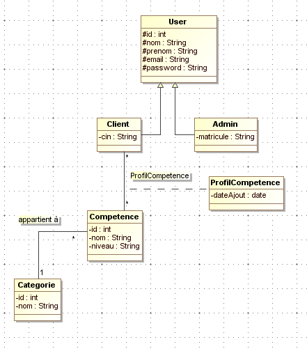
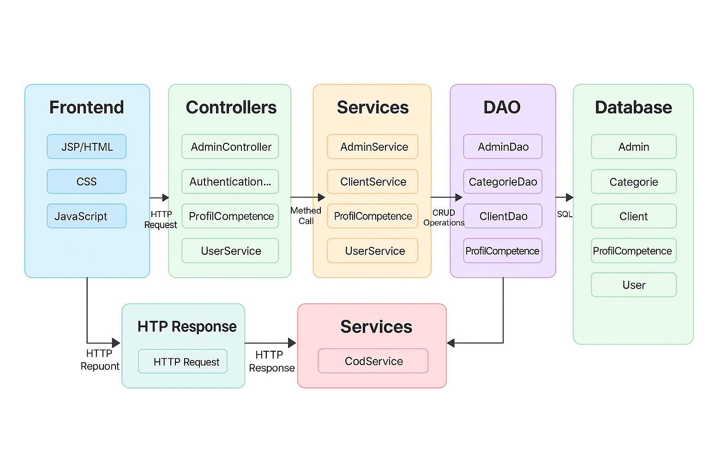

# **Projet : Gestion des Compétences** 🌟
   

## 📌 Table des matières
- [Contexte](#contexte)
- [Problématique](#problématique)
- [Objectifs](#objectifs)
- [Technologies Utilisées](#technologies-utilisées)
-  [Logo](#logo)
- [Diagramme de classe](#diagramme-de-classe)
- [Modèle conceptuel de la base de donnée](#modèle-conceptuel-de-la-base-de-donnée)
- [Architecture](#architecture)
- [Vidéo démonstrative](#Vidéo-Démonstrative)

---

## **Contexte** 🌐

Avec l’évolution rapide du marché de l’emploi et la transformation digitale des entreprises, la gestion des compétences devient un enjeu central. Les organisations cherchent à mieux identifier, valoriser et développer les compétences de leurs collaborateurs. De même, les individus souhaitent suivre l’évolution de leur parcours professionnel et mettre en avant leurs compétences clés.

Ce projet s’inscrit dans cette dynamique en proposant une plateforme numérique de gestion des compétences, destinée aux utilisateurs qui souhaitent suivre leurs compétences et aux administrateurs qui veulent avoir une vue d’ensemble sur les talents disponibles et les tendances.

---

## **Problématique** ❗️

La gestion des compétences est souvent confrontée à plusieurs problèmes :

- 🔍 **Manque de visibilité des compétences individuelles** : Les utilisateurs ont du mal à centraliser et suivre leurs compétences dans le temps.

- 📁 **Absence de structuration claire des données** : Les systèmes classiques ne permettent pas une classification efficace des compétences par catégories, rendant leur gestion complexe.

- 📊 **Difficulté à produire des statistiques pertinentes** : Il est souvent compliqué d’avoir une vision synthétique des compétences disponibles par catégorie ou par utilisateur.

---

## **Objectifs** 🎯

Ce projet vise à offrir une solution intuitive et performante pour répondre aux besoins précédemment évoqués, avec les objectifs suivants :

1. 🧑‍💻 **Permettre aux utilisateurs d’ajouter et gérer leurs compétences**  
   Interface simple pour ajouter une compétence avec son niveau, classée par catégorie.

2. 📌 **Afficher les compétences sous forme de tableau dynamique**  
   Avec possibilité de suppression et modification en temps réel via AJAX.

3. 📊 **Afficher des statistiques par catégorie**  
   Grâce à `Chart.js`, les utilisateurs peuvent visualiser quelles catégories sont les plus développées dans leur profil ou dans la base globale.

   
4. 🛠 **Permettre aux administrateurs de superviser les profils**  
   Un tableau de bord permet de visualiser les profils, les compétences ajoutées, les dates d’ajout, etc.

---

##  🛠 **Technologies Utilisées** 

- 💻 **Java Web**
- 🗃 **Base de données** : MySQL
- 📈 **Chart.js** pour les statistiques dynamiques
- ⚡ **AJAX** pour l'ajout/suppression en temps réel
- 🧩 **Hibernate** pour la persistance des données

---
## **Logo** 🧩

---
## **Diagramme de classe** 🧩

---

## **Modèle conceptuel de la base de donnée** 🧠

---

## **Architecture** 🧩
SkillBoard/
│
├── Web Pages/
│   ├── WEB-INF/
│   │   └── glassfish-web.xml         # Configuration du déploiement GlassFish
│   ├── images/                       # Répertoire pour les ressources images (non affichées ici)
│   ├── Authentification.jsp          # Page de connexion
│   ├── Inscription.jsp               # Page d'inscription client
│   ├── forgotPassword.jsp            # Réinitialisation du mot de passe
│   ├── graphe.jsp                    # Graphique des statistiques (Chart.js)
│   ├── mesCompetences.jsp            # Liste des compétences du profil client
│   ├── profil.jsp                    # Profil de l'utilisateur
│   ├── statistiques.jsp              # Statistiques globales
│   ├── updateMotdePasse.jsp          # Mise à jour du mot de passe
│   ├── updateUser.jsp                # Mise à jour des informations du profil
│   ├── users.jsp                     # Liste des utilisateurs (admin)
│   └── verification.jsp              # Vérification du compte
│
├── Source Packages/
│   ├── config/
│   │   └── hibernate.cfg.xml         # Configuration Hibernate (connexion BD)
│
│   ├── controllers/                  # Contrôleurs Java (traitement des requêtes)
│   │   ├── AdminController.java
│   │   ├── AuthentificationController.java
│   │   ├── ClientController.java
│   │   ├── CompetenceController.java
│   │   ├── DeconnexionController.java
│   │   ├── InscriptionController.java
│   │   ├── ProfilClientController.java
│   │   ├── ProfilCompetenceController.java
│   │   ├── ProfilCompetenceNiveauStatController.java
│   │   ├── StatistiquesController.java
│   │   ├── UpdatePasswordController.java
│   │   ├── UserController.java
│   │   └── VerificationController.java
│
│   ├── dao/                          # Accès aux données via Hibernate
│   │   ├── AbstractDao.java
│   │   ├── AdminDao.java
│   │   ├── CategorieDao.java
│   │   ├── ClientDao.java
│   │   ├── CompetenceDao.java
│   │   ├── ProfilCompetenceDao.java
│   │   └── UserDao.java
│
│   ├── entities/                     # Entités JPA/Hibernate
│   │   ├── Admin.java
│   │   ├── Categorie.java
│   │   ├── Client.java
│   │   ├── Competence.java
│   │   ├── ProfilCompetence.java
│   │   ├── ProfilCompetencePK.java
│   │   └── User.java
│
│   ├── mapper/
│   │   └── CategorieCompetenceCount.java # Objet pour le mapping des statistiques
│
│   ├── services/                     # Logique métier
│   │   ├── AdminService.java
│   │   ├── ClientService.java
│   │   ├── IService.java             # Interface commune
│   │   ├── ProfilCompetenceService.java
│   │   ├── SendMail.java             # Envoi d'emails via SMTP
│   │   └── UserService.java
│
│   ├── test/                         # Tests unitaires
│   │   ├── Test.java
│   │   ├── TestCategorie.java
│   │   ├── TestClients.java
│   │   ├── TestCompetence.java
│   │   ├── TestDate.java
│   │   ├── TestEmail.java
│   │   └── TestHibernateConnection.java
│
│   └── util/
│       ├── HibernateUtil.java        # Initialisation de la SessionFactory Hibernate
│       └── Util.java                 # Méthodes utilitaires

---

## 🎥 **Vidéo Démonstrative**

https://github.com/user-attachments/assets/2be94a7e-4e13-4c15-8b11-75eaacd02eba
